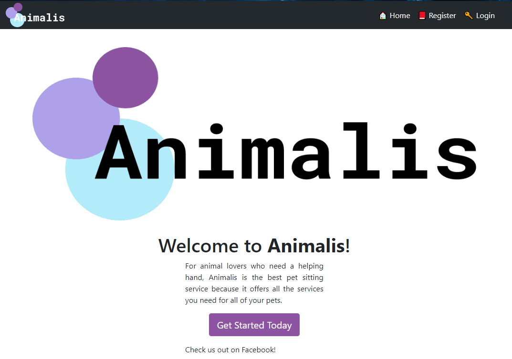

<!---->

# Animalis

This is team Ctrl Alt Elite's Baylor CSI 3335 Software Engineering II semester long group project. This project was a chance for us develop a full-stack web application using new technologies in a team environment over multiple months using agile development processes. With the help of [Credera's](https://www.credera.com/) consulting mentorship and [template project](https://github.com/jlutteringer/petfinder-site), we built a pet sitting service web application called Animalis. 

You can view the Animalis application on our [Heroku page](https://animalis-site.herokuapp.com/).

You can view our task management and progress tracker through our [Trello page](https://trello.com/b/XZJmAk9w).

Here's a screen shot of our website running:

## Ctrl Alt Elite (Group 5) Team Members
* [Sean Blonien](https://www.linkedin.com/in/seanblonien/) - Project Manager
* [John Eyre](https://www.linkedin.com/in/john-eyre-264315124/) - Requirements Engineer
* [Jack Titzman](https://www.linkedin.com/in/jrt0799/) - Design Engineer
* [Jacob Sembroksi](https://www.linkedin.com/in/jacob-sembroski-41014013b/) - Project Librarian

## Documentation
Please view our documentation including the user guide in this [report](project_documentation/Animalis_Project_Report_and_Documentation.docx).

## Running the Project Locally

### Running elasticsearch
This application uses elastic search as a data backend. To run the app you will have to either install elastic search locally or point to a remote elastic search instance. Configuration options are provided in `application.yml`.
1. Install elasticsearch 6.4.2 https://www.elastic.co/downloads/past-releases/elasticsearch-6-4-2
2. Run `elasticsearch` and confirm it started with `curl -XGET 'localhost:9200'`

### Running the Backend in IntelliJ
1. Install Java, Gradle, IntelliJ if you don't already have them
3. Import the project as a Gradle project into IntelliJ (may need a Gradle plugin)
4. Run `petfinder.site.PetfinderApplication.main` with VM args `-Dspring.profiles.active=development`
  * Open PetfinderApplication.java, right click, and Run PetfinderApplication.main(), which should fail
  * Up near the top left you should see a dropdown that now says Petfinder application, click it and select Edit configurations
  * In the menu, you should see a VM Options box, enter `-Dspring.profiles.active=development`, click OK
  * Run the application again, and it should start correctly
5. Go to `http://localhost:8080/` and verify the application is running (you may see a blank page if the frontend isn't running yet, but if it doesn't 404 you are good)

### Running the Frontend
1. Install node if you don't already have it
2. In the project directory run `npm install` from the command line
3. In the project directory run `npm run dev` from the command line
4. Go to `http://localhost:8080/`
5. You should see Animalis logo and website interface if all of the above steps were done correctly!

#### QA/Heroku/Running as QA Locally
In qa there is just a single executable jar which contains the static resources produced from webpack.

1. To build run `gradle install`
2. Build output can be found in `<Root Project Dir>/build/libs/petfinder-site-1.0-SNAPSHOT.jar`
3. This jar is all you need to run the application, to run locally use the following command: `java -jar build/libs/petfinder-site-1.0-SNAPSHOT.jar --spring.profiles.active=qa`
